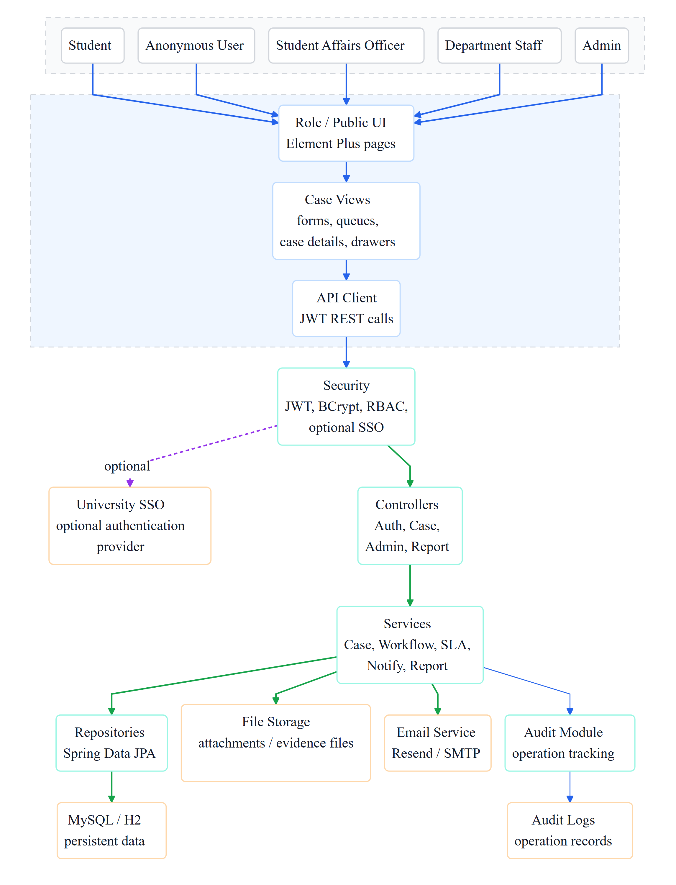

# 学生投诉与反馈管理系统

<a id="readme-top"></a>

<div align="center">

[English](README.md) | 简体中文

Student Complaint and Feedback Management System

面向校园投诉与反馈处理的全栈 Web 应用 · OOAD 课程项目


[](https://github.com/xuzihao723/StudentComplaintAndManagementSystem/stargazers)

[在线演示](https://student-complaint-frontend.onrender.com/) · [演示指南](docs/SYSTEM_DEMONSTRATION.md) · [项目报告](docs/project-documentation/Student_Complaint_and_Feedback_Management_System_Project_Report.pdf) · [反馈问题](https://github.com/xuzihao723/StudentComplaintAndManagementSystem/issues)

</div>

## 目录

- [项目简介](#about)
- [功能与角色](#features)
- [在线演示](#demo)
- [技术栈](#stack)
- [快速开始](#getting-started)
- [配置说明](#configuration)
- [项目结构与架构](#structure)
- [主要 API](#api)
- [测试与构建](#testing)
- [云端部署](#deployment)
- [项目文档](#documentation)
- [当前限制与改进方向](#limitations)
- [参与贡献](#contributing)
- [许可证](#license)
- [维护者与致谢](#acknowledgments)

<a id="about"></a>

## 项目简介

本项目为学生、学生事务专员、部门工作人员和管理员提供统一的投诉与反馈处理平台，将提交、分派、进度更新、解决和关闭串联为可追踪的工作流程。匿名用户也可以在允许匿名的分类下提交投诉，并使用跟踪码查询处理情况。

项目采用前后端分离架构，包含 Vue 前端、Spring Boot API、关系数据库、附件存储、通知和审计记录。作为面向对象分析与设计（OOAD）课程项目，仓库同时提供项目报告、UML 与数据库设计图，以及课堂演示指南。

<a id="features"></a>

## 功能与角色

| 使用者 | 身份标识 | 主要功能 |
| --- | --- | --- |
| 学生 | `STUDENT` | 注册与登录、提交投诉、上传证据、查看案件和消息、提交后续反馈与满意度评价 |
| 匿名用户 | 无需登录 | 在允许匿名的分类下提交投诉，凭跟踪码查询案件和补充消息 |
| 学生事务专员 | `OFFICER` | 审阅新案件、要求补充信息、分派到部门、关闭案件、查看周报 |
| 部门工作人员 | `DEPARTMENT_STAFF` | 查看分派到本部门的案件、更新进度、回复和标记解决 |
| 管理员 | `ADMIN` | 管理用户、部门和分类，生成与导出报表，配置邮件，查看审计日志 |

系统还支持：

- **身份与权限：** JWT 登录会话、BCrypt 密码哈希、按角色和案件归属控制访问。
- **案件协作：** 案件编号、状态记录、消息、内部备注、提醒与逾期监控。
- **附件管理：** 支持 PNG、JPEG、GIF、PDF、DOC、DOCX；单文件上限 10 MB，单次上传请求上限 30 MB。
- **通知与报表：** 站内通知、可选 SMTP / Resend 邮件通知，以及周报生成和导出。
- **本地与部署环境：** H2 文件数据库用于快速演示，MySQL 用于独立数据库运行。

<a id="demo"></a>

## 在线演示

**演示入口：[student-complaint-frontend.onrender.com](https://student-complaint-frontend.onrender.com/)**

### 演示账号

后端启动时会创建以下初始账号；若同名账号已经存在，则保留现有账号。在线环境的账号和数据可能被演示操作修改。

| 角色 | 用户名 | 初始密码 |
| --- | --- | --- |
| 管理员 | `admin` | `Admin123!` |
| 学生事务专员 | `officer` | `Officer123!` |
| 校园设施部门工作人员 | `facility_staff` | `Staff123!` |
| 教务部门工作人员 | `academic_staff` | `Staff123!` |
| 学生 | `student1` | `Student123!` |

这些账号用于课程演示。公开部署前应修改初始密码和默认 JWT 密钥。

### 建议演示流程

1. 以 `student1` 登录，提交投诉并查看案件编号、状态和消息。
2. 退出登录，选择允许匿名的分类提交投诉，保存跟踪码并查询案件。
3. 以 `officer` 登录，将案件分派给对应部门。
4. 以部门工作人员登录，更新处理进度并标记解决。
5. 返回专员界面关闭案件，再展示管理员的用户管理、报表与审计日志。

详细步骤见 [System Demonstration Guide](docs/SYSTEM_DEMONSTRATION.md)。

<a id="stack"></a>

## 技术栈

| 层次 | 技术 | 用途 |
| --- | --- | --- |
| 前端 | Vue 3.5、Element Plus 2.8、Vite 5.4 | 角色界面、表单和前端构建 |
| HTTP 客户端 | Axios | API 请求与 JWT 请求头 |
| 后端 | Java 17、Spring Boot 3.3.5 | REST API 与业务逻辑 |
| 安全 | Spring Security、JWT、BCrypt | 身份认证、权限校验与密码存储 |
| 数据访问 | Spring Data JPA、Hibernate | 实体映射与持久化 |
| 数据库 | H2 / MySQL 8.4（Docker Compose） | 本地演示 / 独立数据库 |
| 邮件 | Spring Mail、Resend HTTP API | 可选邮件通知 |
| 测试 | JUnit、Spring Boot Test、Vitest | 后端逻辑与前端模块测试 |

版本依据 [backend/pom.xml](backend/pom.xml) 和 [frontend/package.json](frontend/package.json)；前端实际依赖版本由 `package-lock.json` 锁定。

<a id="getting-started"></a>

## 快速开始

### 环境要求

- Git
- JDK 17 或更高版本，并配置 `JAVA_HOME`
- Maven 3.9.x
- Node.js 20 或更高版本，以及 npm
- Docker 与 Docker Compose（仅 MySQL 模式需要）

### 1. 获取项目

```bash
git clone https://github.com/xuzihao723/StudentComplaintAndManagementSystem.git
cd StudentComplaintAndManagementSystem
```

### 2. 启动后端：H2 演示模式

在项目根目录打开终端：

```bash
cd backend
mvn spring-boot:run "-Dspring-boot.run.profiles=dev"
```

该命令也适用于 Windows PowerShell。`dev` 配置使用文件型 H2 数据库，数据保存在 `backend/data/`，无需单独安装数据库。

### 3. 启动前端

在项目根目录打开另一个终端：

```bash
cd frontend
npm ci
npm run dev
```

| 入口 | 地址 / 配置 |
| --- | --- |
| 前端应用 | [http://localhost:5173](http://localhost:5173) |
| 后端 API 基地址 | `http://localhost:8080/api` |
| H2 控制台（仅 `dev` 配置） | [http://localhost:8080/h2-console](http://localhost:8080/h2-console) |
| H2 JDBC URL | `jdbc:h2:file:./data/scfs-dev;MODE=MySQL;DATABASE_TO_LOWER=TRUE;CASE_INSENSITIVE_IDENTIFIERS=TRUE` |
| H2 用户名 / 密码 | `sa` / 留空 |

前端开发服务器默认将 `/api` 请求代理到 `http://127.0.0.1:8080`。使用上方演示账号即可体验完整流程。

### 4. 可选：使用 MySQL

在项目根目录执行：

```bash
docker compose up -d mysql
```

等待 MySQL 完成初始化后，启动后端，**不要启用 `dev` 配置**：

```bash
cd backend
mvn spring-boot:run
```

Compose 默认创建数据库 `scfs`、用户 `scfs` 和本地演示密码 `scfs_password`，映射端口为 `3306`，与后端默认配置一致。前端启动方式不变。Docker 命名卷 `scfs_mysql_data` 用于保存数据库数据。

<a id="configuration"></a>

## 配置说明

后端配置见 [application.yml](backend/src/main/resources/application.yml) 和 [application-dev.yml](backend/src/main/resources/application-dev.yml)。

| 环境变量 | 默认值 | 说明 |
| --- | --- | --- |
| `PORT` | `8080` | 后端监听端口 |
| `DB_URL` | 本地 MySQL 的 `scfs` 数据库 | JDBC 连接地址；`dev` 配置使用自己的 H2 地址 |
| `DB_USERNAME` / `DB_PASSWORD` | `scfs` / `scfs_password` | MySQL 凭据；`dev` 配置使用 H2 凭据 |
| `JWT_SECRET` | 内置演示密钥 | 公开部署时替换为随机密钥 |
| `JWT_EXPIRATION_MINUTES` | `480` | 登录令牌有效时长，单位为分钟 |
| `UPLOAD_DIR` | `uploads` | 后端附件目录；`dev` 配置固定使用 `uploads` |
| `FRONTEND_URL` | `http://localhost:5173` | 邮件等功能使用的前端地址 |
| `CORS_ALLOWED_ORIGIN_PATTERNS` | `http://localhost:*,http://127.0.0.1:*` | 允许跨域访问的来源，多个值以逗号分隔 |
| `VITE_API_PROXY` | `http://127.0.0.1:8080` | 前端开发环境 `/api` 代理目标 |
| `VITE_API_BASE_URL` | `/api` | 前端 API 基地址；独立部署时填写后端地址并包含 `/api` |

`VITE_API_BASE_URL` 在前端构建时读取，修改后需重新构建。后端环境变量修改后需重启后端。

### 可选邮件通知

站内通知与邮件发送分别记录。未配置邮件服务时，站内通知仍会保存，邮件状态会记录发送失败。

配置方式：

- **Resend：** 设置 `EMAIL_API_PROVIDER=resend`、`RESEND_API_KEY` 和 `RESEND_FROM_ADDRESS`。
- **SMTP：** 设置 `MAIL_HOST`、`MAIL_PORT`、`MAIL_USERNAME`、`MAIL_PASSWORD`，并在管理员邮件设置中检查发件地址、认证和 TLS 配置。

配置完成后，还需以管理员身份进入邮件设置页面，启用发送并使用测试功能验证。当 Resend 已配置时，邮件服务优先选择 Resend。

PowerShell 环境变量示例（在启动后端的同一终端执行）：

```powershell
$env:EMAIL_API_PROVIDER = "resend"
$env:RESEND_API_KEY = "your-resend-api-key"
$env:RESEND_FROM_ADDRESS = "Complaint System <no-reply@example.com>"
```

Bash 环境变量示例：

```bash
export EMAIL_API_PROVIDER="resend"
export RESEND_API_KEY="your-resend-api-key"
export RESEND_FROM_ADDRESS="Complaint System <no-reply@example.com>"
```

<a id="structure"></a>

## 项目结构与架构

```text
StudentComplaintAndManagementSystem/
├── backend/
│   ├── src/main/java/edu/demo/scfs/
│   │   ├── config/          # 初始数据与配置
│   │   ├── domain/          # 领域实体与枚举
│   │   ├── repository/      # JPA 数据访问
│   │   ├── security/        # JWT 与权限控制
│   │   ├── service/         # 案件、通知和报表等业务逻辑
│   │   └── web/             # REST 控制器与 DTO
│   ├── src/main/resources/  # MySQL / H2 配置
│   ├── src/test/            # 后端测试
│   ├── Dockerfile
│   └── pom.xml
├── frontend/
│   ├── src/                # Vue 界面、API 客户端与模块测试
│   ├── public/             # 静态资源
│   ├── package.json
│   └── package-lock.json
├── docs/
│   ├── SYSTEM_DEMONSTRATION.md
│   └── project-documentation/
│       ├── figures/        # 架构、UML、ER 与流程图
│       └── ...             # 项目报告与 LaTeX 源码
├── docker-compose.yml      # 本地 MySQL 服务
├── DEPLOYMENT_RENDER_AIVEN.md
├── PRODUCT.md
├── DESIGN.md
├── README.md               # 英文首页
└── README.zh-CN.md         # 中文说明
```

前端经 API 客户端访问 Spring Boot 控制器，业务服务通过 JPA 保存数据，并调用附件存储、通知和审计模块。

<details>
<summary>展开查看项目报告中的系统架构图</summary>



图中的 University SSO 是设计中的可选扩展，当前实现使用本地账号认证。

</details>

<a id="api"></a>

## 主要 API

以下为常用接口摘要；完整路由与请求字段见 [后端控制器及 DTO](backend/src/main/java/edu/demo/scfs/web)。受保护接口使用 `Authorization: Bearer <token>`，提交案件和证据使用 `multipart/form-data`。

| 模块 | 方法与路径 | 用途 |
| --- | --- | --- |
| 身份认证 | `POST /api/auth/register/student`、`POST /api/auth/login`、`GET /api/auth/me` | 学生注册、登录、获取当前用户 |
| 基础数据 | `GET /api/reference/departments`、`GET /api/reference/categories` | 查询部门与分类 |
| 匿名案件 | `POST /api/public/cases`、`POST /api/public/cases/track`、`POST /api/public/cases/track/messages` | 提交、跟踪与补充消息 |
| 学生案件 | `POST /api/student/cases`、`GET /api/student/cases` | 提交与查询本人案件 |
| 学生反馈 | `POST /api/student/cases/{id}/messages`、`POST /api/student/cases/{id}/follow-up` | 发送消息与后续反馈 |
| 专员处理 | `GET /api/officer/cases/new`、`POST /api/officer/cases/{id}/assign` | 查看新案件与分派 |
| 补充与关闭 | `POST /api/officer/cases/{id}/request-info`、`POST /api/officer/cases/{id}/close` | 要求补充资料与关闭案件 |
| 部门处理 | `GET /api/department/cases`、`POST /api/department/cases/{id}/progress`、`POST /api/department/cases/{id}/resolve` | 查看分派、更新进度与标记解决 |
| 用户管理 | `GET /api/admin/users`、`POST /api/admin/users` | 查询与创建用户 |
| 周报 | `GET /api/admin/reports/weekly`、`POST /api/admin/reports/weekly/generate` | 查看与生成周报 |
| 通知与审计 | `GET /api/notifications`、`GET /api/admin/audit-logs` | 当前用户通知与管理员审计记录 |

<a id="testing"></a>

## 测试与构建

在项目根目录执行后端测试：

```bash
mvn -f backend/pom.xml test
```

在项目根目录执行前端测试与构建：

```bash
npm --prefix frontend ci
npm --prefix frontend test
npm --prefix frontend run build
```

后端测试覆盖案件编号、跟踪码、分类策略、SLA 策略、通知流、邮件设置和个人资料逻辑；前端测试覆盖 API 客户端和界面展示模块。前端构建输出在 `frontend/dist/`。

需要后端可执行 JAR 时运行：

```bash
mvn -f backend/pom.xml package
```

输出位于 `backend/target/`。现有单元测试不能替代完整的浏览器流程验证，建议结合演示指南检查各角色操作。

<a id="deployment"></a>

## 云端部署

仓库提供 [Render + Aiven 部署指南](DEPLOYMENT_RENDER_AIVEN.md)：

| 组件 | 部署方式 | 关键设置 |
| --- | --- | --- |
| 后端 | Render Web Service，Docker 运行时 | 根目录 `backend`，使用现有 `Dockerfile`，配置数据库、JWT 与 CORS |
| 前端 | Render Static Site | 根目录 `frontend`；构建命令 `npm ci && npm run build`；发布目录 `dist` |
| 数据库 | Aiven MySQL | 将连接地址与凭据配置到后端环境变量 |

前端构建时将 `VITE_API_BASE_URL` 设置为实际后端地址，例如 `https://your-backend.onrender.com/api`；后端的 `FRONTEND_URL` 和 CORS 来源应对应实际前端域名。

部署指南包含免费层演示方案，具体套餐、额度和休眠规则以服务商当前说明为准。附件使用容器本地目录，部署时应配置持久化存储。仓库首页发布到 GitHub 后，在线应用仍由上述服务运行。

<a id="documentation"></a>

## 项目文档

| 文档 | 内容 |
| --- | --- |
| [系统演示指南](docs/SYSTEM_DEMONSTRATION.md) | 演示账号、操作流程与课程展示要求 |
| [项目报告 PDF](docs/project-documentation/Student_Complaint_and_Feedback_Management_System_Project_Report.pdf) | 需求分析、面向对象设计与系统说明 |
| [项目报告 LaTeX 源码](docs/project-documentation/Student_Complaint_and_Feedback_Management_System_Project_Report.tex) | 报告的可编辑源文件 |
| [项目标题与范围声明](Project_Title_and_Scope_Statement.pdf) | 项目选题与范围 |
| [产品说明](PRODUCT.md) | 功能范围与产品需求 |
| [设计说明](DESIGN.md) | 技术设计与实现约定 |
| [设计图目录](docs/project-documentation/figures) | 架构图、用例图、类图、活动图、时序图、ER 图与角色导航图 |
| [云端部署指南](DEPLOYMENT_RENDER_AIVEN.md) | Render 前后端与 Aiven MySQL 的部署步骤 |

<a id="limitations"></a>

## 当前限制与改进方向

- **项目定位：** 当前版本用于课程展示和原型验证；公开运行需要结合实际环境完善配置与运维。
- **身份集成：** 大学 SSO 仅作为设计扩展，尚未接入。
- **附件存储：** 当前保存在后端本地目录，容器重建可能导致文件丢失；可进一步接入持久化卷或对象存储。
- **邮件通知：** 依赖有效的服务凭据和管理员配置，发送结果以通知记录中的邮件状态为准。
- **附件扫描：** 当前文件存储代码检查大小和 MIME 类型，尚未接入真实的病毒扫描服务。

<a id="contributing"></a>

## 参与贡献

欢迎通过 [Issues](https://github.com/xuzihao723/StudentComplaintAndManagementSystem/issues) 提交问题或改进建议。问题报告请附上运行环境、复现步骤、预期行为与实际结果。

提交代码的建议流程：

1. Fork 仓库并创建功能分支。
2. 完成修改，更新相关说明。
3. 执行与修改相关的测试；前端修改还需检查构建结果。
4. 提交 Pull Request，说明修改内容和验证结果。

请勿将真实数据库密码、邮件凭据、JWT 密钥或个人投诉数据提交到仓库。更新共有文档内容时，请同步维护两种语言版本。

<a id="license"></a>

## 许可证

当前仓库尚未提供 `LICENSE` 文件，授权方式有待维护者明确。

<a id="acknowledgments"></a>

## 维护者与致谢

维护者：[xuzihao723](https://github.com/xuzihao723) · 项目仓库：[StudentComplaintAndManagementSystem](https://github.com/xuzihao723/StudentComplaintAndManagementSystem)

README 的组织与展示方式参考：

- [Awesome README](https://github.com/matiassingers/awesome-readme)：清晰简介、技术标识、目录导航与可视化文档。
- [Best README Template](https://github.com/othneildrew/Best-README-Template)：项目介绍、安装使用、贡献、许可证与致谢的分区结构。

感谢 Vue、Element Plus、Spring Boot 等开源项目。

[返回顶部](#readme-top)
